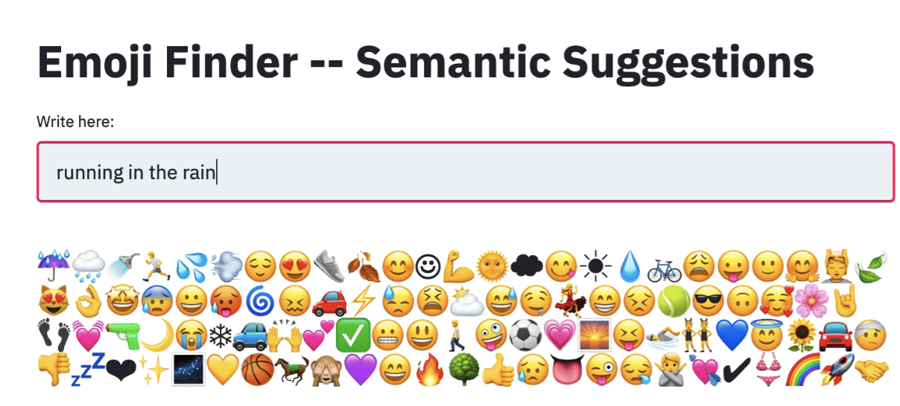

# Emoji Recommender 

## ❓ Why

I like adding emoji to text. 😁

However, sometimes I don't know which one to add. 🤷

There are too many emoji, it is overwhelming. 😖

And built-in finder on my laptop is too literal. 🙅

I would like to get more meaningful suggestions. 💌

## 👉 Inspiration

Use https://github.com/VinAIResearch/BERTweet with the MaskLM task to find emoji that fit a sentence

## 👀 Watch out for

* Some emoji are not included in that vocab: e.g. spider 🕷 and spiderweb 🕸.

# Docker commands

docker build -t emoji-recommender:latest "."

docker run --rm -it -p 8080:8080/tcp emoji-recommender:latest